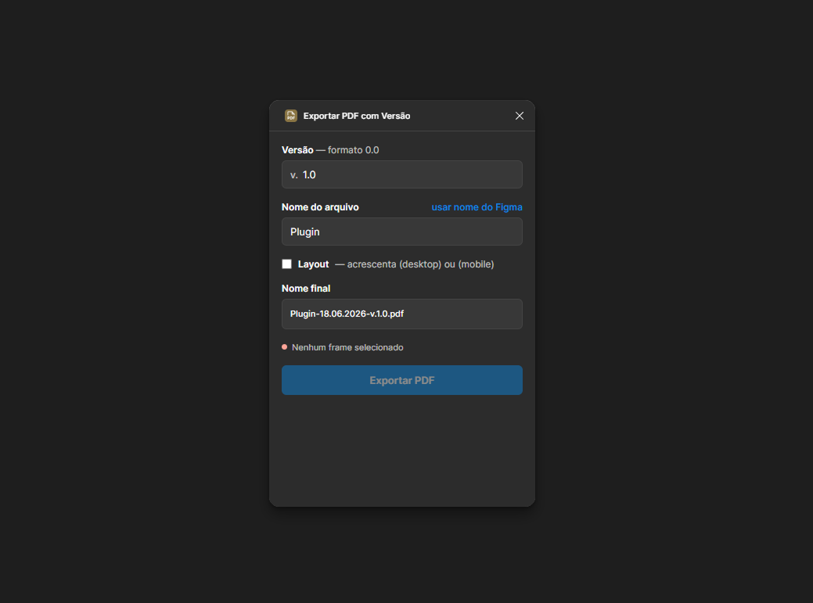

# Exportar PDF com Versão

> Plugin do Figma para exportar uma ou várias telas em **PDF** já com **nome padronizado, data e versão** no nome do arquivo.

Uma forma rápida de exportar telas em PDF nomeando os arquivos de maneira consistente — incluindo a data da exportação e o número da versão — direto do Figma, sem renomear nada à mão.

Além da nomeação, o plugin resolve o resto do caminho até a entrega: exporta **várias telas de uma vez** (arquivos separados ou um PDF multipágina), **comprime** quando o arquivo precisa ficar leve, **mostra o tamanho final antes de exportar** e ainda embala tudo num **`.zip`**.

<p align="center">
  
</p>

---

## ✨ O que ele faz

Ao exportar, o plugin monta automaticamente um nome de arquivo no formato:

```
NomeDoArquivo (layout)-DD.MM.AAAA-v.X.Y.pdf
```

Exemplo real:

```
Home (desktop)-05.08.2026-v.1.0.pdf
```

Cada parte do nome é montada a partir dos campos da interface:

| Parte | Origem | Exemplo |
|-------|--------|---------|
| **Nome do arquivo** | Campo editável (ou nome do documento do Figma) | `Home` |
| **Sufixo de layout** *(opcional)* | Checkbox — detecta `(desktop)` ou `(mobile)` pela largura do frame | `(desktop)` |
| **Data** | Data atual, formato `DD.MM.AAAA` | `05.08.2026` |
| **Versão** | Campo de versão, normalizado para `X.Y` | `v.1.0` |

## 🖼️ Exportando várias telas

Selecione quantas telas quiser e escolha o modo de exportação. O seletor **Como exportar** só aparece a partir de **duas telas selecionadas** — com uma só, os dois modos gerariam exatamente o mesmo arquivo. A escolha fica guardada: se a seleção diminuir para uma tela e voltar a crescer, o modo escolhido continua lá.

### Arquivos separados — 1 PDF por tela

Gera um PDF por tela selecionada, todos com a mesma data e versão. Com **mais de uma** tela, o nome do frame entra no arquivo:

```
Projeto-Home (desktop)-05.08.2026-v.1.0.pdf
Projeto-Login (mobile)-05.08.2026-v.1.0.pdf
```

Com apenas **uma** tela selecionada, o nome segue o formato original (sem o nome do frame). O sufixo de layout é calculado por tela, então cada arquivo recebe `(desktop)` ou `(mobile)` conforme a própria largura.

### PDF único — 1 página por tela

Gera **um só arquivo** com uma página por tela, na ordem mostrada na lista (use as setas ▲▼ para reordenar):

```
Projeto (desktop+mobile)-05.08.2026-v.1.0.pdf
```

Quando as telas têm larguras mistas, o sufixo de layout vira `(desktop+mobile)`.

## 🗜️ Compressão

O PDF vetorial do Figma é ótimo em qualidade, mas pesado — especialmente com imagens embutidas. O campo **Compressão** troca qualidade por tamanho:

| Opção | Resolução | Qualidade JPEG |
|-------|-----------|----------------|
| **Nenhuma** | vetorial (sem rasterizar) | — |
| **Leve** | 144 DPI | 92% |
| **Média** | 108 DPI | 82% |
| **Máxima** | 72 DPI | 65% |
| **Personalizada** | 36–288 DPI | 30–100% |

Com qualquer opção diferente de *Nenhuma*, as telas são rasterizadas e embutidas como JPEG. **O texto deixa de ser selecionável** — é a troca em jogo.

Quanto isso reduz depende inteiramente do conteúdo: uma tela com fotos e áreas planas encolhe muito, uma tela densa de texto pequeno encolhe menos e perde nitidez mais rápido. Em vez de chutar, use **calcular tamanhos** e veja o número da sua tela.

### Prévia do tamanho final

Clique em **calcular tamanhos** — ao lado do campo *Compressão* — para ver, antes de exportar, quanto cada arquivo vai pesar. O resultado aparece na lista de telas (números do exemplo são ilustrativos):

```
Telas selecionadas — 3 tela(s)
1  Home                        1,8 MB  89 KB
2  Login                       410 KB  64 KB
3  Dashboard                   3,0 MB  105 KB
Total: 5,1 MB → 258 KB (−95%)
```

Os números não são chute: o plugin exporta e monta os arquivos de verdade para medir. Os nomes na pré-visualização também passam a mostrar o tamanho de cada um.

| O que está sendo medido | Como o número aparece |
|-------------------------|-----------------------|
| Um PDF por tela, com ou sem compressão | **exato** — o arquivo é montado para medir |
| PDF único **com** compressão | **exato** — o multipágina é montado para medir |
| PDF único **sem** compressão | `≈` soma dos PDFs individuais, porque o Figma compartilha fontes entre as páginas e o tamanho real só se sabe depois de exportar |
| `.zip` | `até` — teto garantido, nunca maior (veja abaixo) |

Depois de calcular, exportar é instantâneo — os bitmaps ficam em cache e são reaproveitados. E as medições do PDF vetorial, que são a parte lenta, sobrevivem à troca de preset de compressão.

## 📦 Compactar em .zip

Marcando **Compactar em .zip**, tudo vira **um único download** em vez de vários. Aparece um campo para o nome do pacote, já preenchido com o nome do arquivo:

```
Entrega Sprint 12-05.08.2026-v.1.0.zip — até 259 KB
  Projeto-Home (desktop)-05.08.2026-v.1.0.pdf — 89 KB
  Projeto-Login (mobile)-05.08.2026-v.1.0.pdf — 64 KB
  Projeto-Dashboard-05.08.2026-v.1.0.pdf — 105 KB
```

Os PDFs ficam na raiz do `.zip` (sem pasta extra dentro — Windows e macOS já extraem para uma pasta com o nome do arquivo). Funciona com qualquer combinação: arquivos separados, PDF único, com ou sem compressão. Como vem tudo num arquivo só, o `.zip` também evita o aviso de *"baixar vários arquivos"* do navegador.

O tamanho na prévia é um **limite superior**, não uma estimativa — e a diferença aqui é grande. O ganho do DEFLATE sobre um PDF varia demais para prever:

| Conteúdo do bitmap | JPEG | Depois do DEFLATE |
|--------------------|------|-------------------|
| Tela de UI com áreas planas | 49.099 B | 4.314 B (**−91,2%**) |
| Bitmap ruidoso, tipo foto | 912.218 B | 910.599 B (−0,2%) |

Blocos idênticos numa UI plana geram padrões repetidos no stream do JPEG, e o DEFLATE os encontra; num bitmap ruidoso não há nada a encontrar. Como o plugin só usa DEFLATE quando ele reduz de fato, o `.zip` **nunca passa do teto mostrado** — só pode vir menor. O tamanho real aparece na mensagem final:

```
.zip exportado com 3 arquivo(s) — 318 KB.
```

## ⏳ Durante a exportação

Ao clicar em **Exportar**, o formulário inteiro vira *skeleton* — blocos cinza com uma varredura de luz — e o botão ganha spinner, contador e barra de progresso:

```
[ ◌  Exportando 2/3 — Login        ▓▓▓▓▓▓▓░░░░░░░ ]
```

- Os blocos preservam a altura original, então **não há salto de layout** ao entrar e sair do estado de carregamento.
- A barra é **determinada** quando o total é conhecido (`2/3`) e vira uma faixa correndo nas etapas sem contagem — montagem das páginas, geração do PDF final.
- A animação dura até a exportação concluir, com um piso de 450 ms para que um export instantâneo não pisque na tela.
- Ao concluir, o botão fica **verde com "✓ Exportado"** por alguns segundos — o desfecho não depende só da linha de mensagem.
- `prefers-reduced-motion` desliga as animações e mantém só os blocos estáticos.

### Quando dá erro

A animação é cancelada **na hora** (sem esperar o piso), o formulário volta ao normal e aparece um painel com a mensagem e os detalhes técnicos recolhidos:

```
Erro ao processar a imagem de "Home".        ver detalhes  copiar
┌────────────────────────────────────────────────────────┐
│ Tela: Home (1:1)                                       │
│ Bitmap: 1440×900 pt, escala 1.5                        │
│ Etapa: exportação                                      │
│ Mensagem: The source image could not be decoded.       │
│ Error: ... (stack)                                     │
└────────────────────────────────────────────────────────┘
```

Os detalhes trazem o passo em que o plugin estava, a tela envolvida, a configuração em uso e o stack — é o que dá para colar num relato de bug. O botão **copiar** manda tudo para a área de transferência (se o iframe bloquear o clipboard, o painel abre os detalhes para seleção manual).

## 🎯 Recursos

**Nomeação**

- **Versão padronizada** — o campo aceita só números e ponto, e é normalizado para o formato `X.Y` (ex.: `1` vira `1.0`). O minor é preservado como texto: `1.10` e `2.25` continuam `1.10` e `2.25`.
- **Nome editável** — por padrão usa o nome do documento do Figma, com link rápido para restaurá-lo (*"usar nome do Figma"*).
- **Sufixo de layout automático** — marcando *Sufixo de layout*, o plugin acrescenta `(desktop)` ou `(mobile)` ao nome com base na largura do frame (≥ 400px = desktop).
- **Pré-visualização ao vivo** — o campo *Nome final* mostra exatamente como os arquivos serão salvos, atualizando em tempo real.
- **Nomes sem colisão** — nomes repetidos no mesmo lote recebem sufixo numérico automático, e caracteres inválidos (`/ \ : * ? " < > |`) são trocados por `-`.

**Exportação**

- **Lote** — exporta todas as telas selecionadas de uma vez, como arquivos separados ou como um PDF único multipágina.
- **Lista ordenável** — mostra as telas selecionadas com dimensões; no modo *PDF único* a ordem da lista define a ordem das páginas.
- **Compressão opcional** — 3 presets + modo personalizado (resolução e qualidade JPEG), com aviso claro de que o texto deixa de ser selecionável.
- **Pacote .zip** — junta tudo num único download, com nome próprio; DEFLATE nativo, sem bibliotecas externas.
- **Prévia de tamanho medida** — mostra o peso final de cada arquivo e o total antes/depois, com o percentual de redução.

**Interface**

- **Skeleton na exportação** — o formulário vira blocos pulsantes e o botão ganha spinner, contador `3/8` e barra de progresso, sem salto de layout.
- **Erro com detalhes** — a animação é cancelada e um painel mostra a mensagem, a etapa, a tela envolvida, a configuração e o stack, com botão para copiar.
- **Só o que faz sentido aparece** — o seletor de modo surge com 2+ telas; o campo de nome do `.zip`, ao marcar o check.
- **Tema nativo** — segue automaticamente o tema claro/escuro do Figma (`themeColors`), e respeita `prefers-reduced-motion`.
- **Preferências lembradas** — modo, compressão, sufixo de layout e `.zip` ficam salvos entre sessões (`clientStorage`); quem exporta sempre do mesmo jeito abre o plugin já configurado. Nome e versão não são lembrados de propósito: mudam a cada entrega.

## ⚙️ Instalação (modo desenvolvimento)

Como o plugin ainda não está publicado na Figma Community, você o roda localmente:

1. Clone ou baixe este repositório:
   ```bash
   git clone https://github.com/lucasbatistaribeiro/figma-export-pdf-with-version.git
   ```
2. No **Figma Desktop**, vá em **Menu → Plugins → Development → Import plugin from manifest…**
3. Selecione o arquivo [`manifest.json`](manifest.json) deste repositório.
4. Pronto — o plugin aparecerá em **Plugins → Development → Exportar PDF com Versão**.

> O Figma Desktop é necessário para importar plugins em modo de desenvolvimento.

## 🚀 Como usar

1. Selecione **uma ou mais telas** no canvas.
2. Rode o plugin (**Plugins → Development → Exportar PDF com Versão**).
3. Confira as **Telas selecionadas**, no topo (e a ordem, no modo *PDF único*), e escolha **Como exportar** — *Arquivos separados* ou *PDF único* (aparece com 2+ telas).
4. Ajuste a nomeação, conferindo o resultado no **Nome final**, logo abaixo:
   - **Nome do arquivo** — editável (ou use o nome do Figma)
   - **Versão** — ex.: `1.0`
   - **Sufixo de layout** — marque para adicionar `(desktop)`/`(mobile)` ao nome
5. Escolha as opções de saída:
   - **Compressão** — deixe em *Nenhuma* para PDF vetorial, ou escolha um preset
   - **Compactar em .zip** — marque para receber um único arquivo, e dê um nome a ele
6. *(Opcional)* Clique em **calcular tamanhos**, ao lado de *Compressão*, para ver o peso de cada arquivo antes de exportar.
7. Clique em **Exportar** — o download começa automaticamente com os nomes montados.

> Ao exportar vários arquivos soltos, o navegador pode pedir permissão para "baixar vários arquivos". Aceite uma vez e os seguintes passam direto — ou marque **Compactar em .zip**, que baixa um arquivo só e não dispara o aviso.

## 🗂️ Estrutura do projeto

```
.
├── manifest.json     # Configuração do plugin (nome, id, entrypoints)
├── code.js           # Sandbox do Figma: lê a seleção, exporta PDF e bitmaps
├── ui.html           # Interface + nomeação, gerador de PDF, gerador de .zip
├── assets/
│   └── screenshot.png
└── README.md
```

## 🛠️ Como funciona

O plugin é dividido em dois contextos, como toda extensão do Figma. A divisão importa mais aqui do que no plugin original, porque **só a UI tem DOM** — e é o DOM (`<canvas>`, `CompressionStream`, `Blob`) que viabiliza compressão e `.zip` sem bibliotecas externas.

- **[`code.js`](code.js)** roda no sandbox do Figma, sem DOM. Lê a seleção, exporta as telas com `exportAsync` (em `PDF` ou em `PNG` numa escala, quando há compressão) e manda os bytes para a UI. Também escuta `selectionchange` para manter a interface sincronizada.
- **[`ui.html`](ui.html)** é a interface (iframe). Monta os nomes, mostra a pré-visualização, converte bitmaps em JPEG, **escreve o PDF e o `.zip` byte a byte** e dispara os downloads — em fila, com um pequeno intervalo entre arquivos para o navegador não descartar downloads simultâneos.

A comunicação é via `postMessage`:

| Mensagem | Direção | Para quê |
|----------|---------|----------|
| `init` / `info` | UI ⇄ code | estado inicial e seleção atual |
| `saveSettings` / `settings` | UI ⇄ code | preferências persistidas entre sessões (`clientStorage`) |
| `export` | UI → code | inicia a exportação |
| `measure` | UI → code | calcula tamanhos sem baixar nada |
| `raster` / `rasterDone` | code → UI | bitmaps e tamanhos, um por tela |
| `progress` | code → UI | alimenta o contador e a barra do botão |
| `download` | code → UI | PDF pronto (caminho sem compressão) |
| `finished` | code → UI | fim do lote |
| `error` | code → UI | `message` + `details` |

O `error` carrega os detalhes técnicos: o `code.js` mantém um `currentStep` com a última operação em andamento (`exportando PDF de "Login" (FRAME)`, `rasterizando "Home" em 1.50x`), que entra no painel de erro junto com o stack.

> **Requisitos de runtime.** Compressão e `.zip` usam APIs do Chromium disponíveis no Figma Desktop: `createImageBitmap`, `canvas.toBlob` e `CompressionStream`. O `.zip` tem fallback (grava sem compressão se `deflate-raw` não existir); a exportação **sem** compressão não depende de nenhuma delas.

### Como o PDF único é gerado

A API de plugins do Figma exporta **um nó por vez**, e não existe função para juntar PDFs. Para produzir um arquivo multipágina, o plugin usa o mesmo caminho do *Export Frames to PDF* nativo:

1. cria uma **página temporária** (`[export-pdf] temporário`);
2. coloca uma **cópia** de cada tela selecionada nessa página, empilhada de cima para baixo na ordem definida na UI (a ordem das páginas do PDF segue a posição no canvas);
3. exporta a **página inteira** com `page.exportAsync({ format: "PDF" })` — cada frame de nível superior vira uma página;
4. **remove a página temporária** (em `finally`, mesmo se a exportação falhar).

As telas originais não são movidas nem alteradas — só clonadas. A criação/remoção da página temporária aparece no histórico de desfazer (`Ctrl/Cmd+Z`).

### Como a compressão é feita

A API de plugins do Figma **não expõe qualidade nem compressão** no export de PDF (`ExportSettingsPDF` só aceita o formato), e plugins não podem carregar bibliotecas externas. O caminho é montar o PDF na mão:

1. `code.js` exporta cada tela em **PNG** na escala escolhida (`constraint: { type: "SCALE" }`), limitando o bitmap a 8000 px por lado e 40 MP de área;
2. `ui.html` decodifica o PNG num `<canvas>`, achata sobre branco (JPEG não tem transparência) e reencoda com `canvas.toBlob("image/jpeg", qualidade)`;
3. `buildImagePdf()` escreve um PDF mínimo com o JPEG embutido **cru**, via filtro `DCTDecode` — o formato aceita os bytes do JPEG sem reencodar, então não há perda extra;
4. o `MediaBox` de cada página usa o tamanho do frame em pontos, independente da escala do bitmap — é isso que define o DPI (`72 × escala`).

Com compressão ligada, o **PDF único não precisa da página temporária**: o multipágina é montado direto a partir dos bitmaps, sem tocar no documento.

Como o arquivo é montado inteiro em memória antes de baixar, o tamanho mostrado na prévia é o tamanho real dele, byte a byte.

### Como o .zip é feito

Mesma restrição da compressão — sem rede, sem bibliotecas — então o formato é escrito à mão em [`ui.html`](ui.html):

1. `crc32()` calcula o CRC de cada arquivo (tabela própria, conferida contra o `zlib` do Node);
2. `tryDeflate()` comprime via **`CompressionStream("deflate-raw")`** nativo. Se o navegador não tiver `deflate-raw`, ou se o deflate não reduzir nada, a entrada vai **armazenada** (método 0) — um `.zip` igualmente válido;
3. `buildZip()` escreve os *local file headers*, o *central directory* e o *end of central directory*, com o bit 11 de flags ligado para nomes em UTF-8 (acentos sobrevivem);
4. o formato sem ZIP64 tem teto de 4 GB — o plugin verifica e falha com mensagem clara em vez de gerar um arquivo corrompido.

O plugin **não acessa a rede** (`networkAccess: ["none"]`) — tudo acontece localmente.

## 📜 Histórico

O plugin começou exportando **um** frame com nome padronizado. Tudo abaixo entrou em 05.08.2026:

| PR | O que entrou |
|----|--------------|
| [#1](https://github.com/lucasbatistaribeiro/figma-export-pdf-with-version/pull/1) | Exportação de múltiplas telas — arquivos separados ou PDF único multipágina, com lista ordenável e fila de downloads |
| [#2](https://github.com/lucasbatistaribeiro/figma-export-pdf-with-version/pull/2) | Compressão opcional (presets + personalizado) e prévia de tamanho medida |
| [#3](https://github.com/lucasbatistaribeiro/figma-export-pdf-with-version/pull/3) | Seletor de modo só aparece com 2+ telas selecionadas |
| [#4](https://github.com/lucasbatistaribeiro/figma-export-pdf-with-version/pull/4) | Skeleton e botão animado durante a exportação, com painel de erro detalhado |
| [#5](https://github.com/lucasbatistaribeiro/figma-export-pdf-with-version/pull/5) | Opção de compactar tudo em `.zip`, com nome próprio |

## 📄 Licença

Distribuído sob a licença [MIT](LICENSE).
